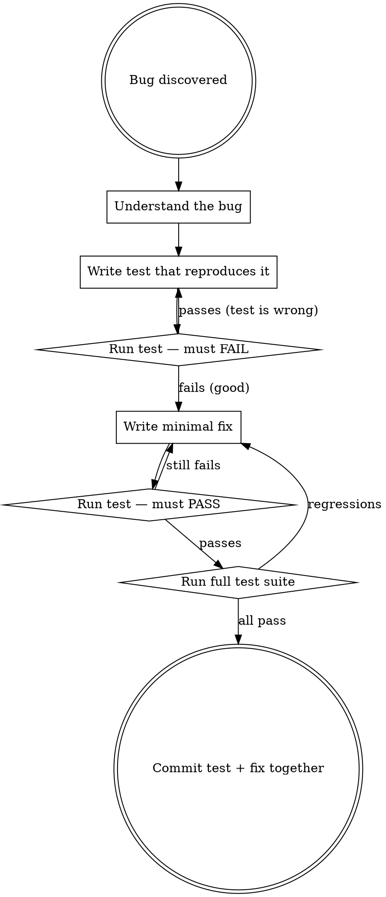

# Bug-Driven Testing

## Overview

Every bug fix MUST start with a failing test that reproduces the bug. No exceptions. The test proves the bug exists, the fix proves it's gone, and the test prevents it from coming back.

## The Rule

```
BUG FOUND → WRITE FAILING TEST → FIX BUG → TEST PASSES → COMMIT
```

Never fix a bug without a regression test. The test is MORE valuable than the fix — the fix solves today's problem, the test prevents tomorrow's.

## Process



## Test Naming Convention

Name regression tests so the bug is obvious:

```typescript
it('should reject empty string as projectPath', () => { ... });
it('should not crash when session has null worktreePath', () => { ... });
it('should handle concurrent webhook deliveries without duplicate notifications', () => { ... });
```

## What Counts as a Bug

- Runtime errors or crashes
- Incorrect behavior (wrong output, wrong state)
- Missing validation (accepts invalid input)
- Race conditions or timing issues
- Security vulnerabilities
- Breaking changes from dependency upgrades (like Zod 4, Vitest 4)
- Any behavior that deviates from what the code should do

## Red Flags — STOP

These thoughts mean you're about to skip the test:

| Thought | Reality |
|---------|---------|
| "It's an obvious one-liner fix" | One-liner bugs recur. Test takes 30 seconds. |
| "I already know the fix" | Knowing the fix != proving the fix works. |
| "The fix is in config, not code" | Config bugs regress too. Write a test. |
| "I'll add the test after" | Tests-after verify what you wrote. Tests-before verify what you need. |
| "This is a dependency issue, not our code" | Our test suite must catch when deps break us. |
| "It's too hard to test" | If it's hard to test, that's a design smell. Simplify, then test. |
| "The existing tests should have caught this" | They didn't. Write the test that does. |

## Commit Strategy

Always commit the test and fix together in one commit. The commit message should reference the bug:

```bash
git commit -m "fix: reject empty projectPath in CreateSessionInput

Added validation test that reproduces the empty string bypass.
z.string().min(1) now enforces non-empty project paths."
```

## Integration with CI

The regression test becomes a permanent guard in CI. If someone accidentally reverts the fix or introduces the same bug through a different path, CI catches it immediately.
